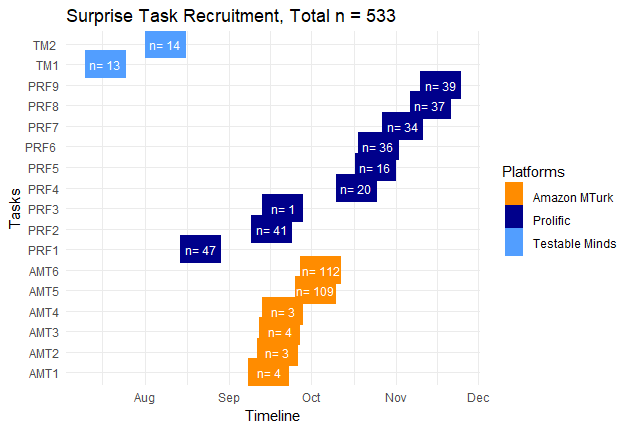

---
title: "Surprises as a Mechanism of Change in Social Anxiety and Depression: 6-month
  report"
date: "26th November 2023"
output:
  pdf_document: 
      extra_dependencies: ["float"]
  word_document: default
    
---  
```{r echo=FALSE}
knitr::opts_chunk$set(fig.pos = "H", out.extra = "")
```


## Project Title: Surprises as a Mechanism of Improvement in the Psychological Therapy of Anxiety and Depression in Young People.
Grant Reference: 226785/Z/22/Z  
Project Start Date: 12/05/2023  
Project End Date: 12/05/2028  

Report authors: Stringaris A (UCL, PI), Biria M (UCL, post-doc), Payne M (UCL, post-doc), Spencer L (Oxford, post-doc), Bagdades E (UCL, research assistant), Burman C (UCL, research assistant), Tromans N (Oxford research assistant), Krebs G (UCL, Co-I), Leigh E (Oxford, Co-I), Singh I (Oxford, Co-I).  
  
  
**Progress made over the past six months** 
  
We have made good progress towards our goals as indicated by the following:

-  Recruitment of post-doctoral researchers and research assistants. Two post-doctoral researchers have joined the team through UCL, Drs Biria (01/02/2023) and Payne (07/08/2023), both cognitive neuroscientists, and Dr Lucienne Spencer, a philosopher, has joined the team through Oxford. Ms Elena Bagdades, a psychologist with a background in computational neuroscience and Charlotte Burman, a psychologist with clinical training, have joined through UCL as research assistants; Ms Naomi Tromans, a psychologist with a background in developmental and clinical psychology, joined through Oxford. We have weekly inter-disciplinary meetings between the UCL and Oxford sites. Please see Fig 1 depicting some of the members of the team (photo with all involved coming soon).

```{r echo=FALSE, out.width='85%', fig.cap= "Members of the surprise team at dinner with colleagues"}


```

- Recruitment of Young People's Advisory Group  
A key aspect of this project is facilitating co-production with the NEUROSEC Young People’s Advisory Group (YPAG). The YPAG members who have assisted the project are Asher Wood, Clara Sayers, Emerson Earl, Sophie Pannett Smith, Eve Lownds, Juniper Sweet and Caitlin Brookes. We have met with the YPAG members for co-production on the surprise project on three occasions  (26/06/2023, 26/09/2023, 30/10/2023). Thus far, the YPAG members have participated in the surprise project task and have provided detailed feedback on how the task can be adapted to better suit the project's aims. The YPAG members were given the time to reflect upon how the task made them feel and in the session they were asked open questions. We have applied these valuable insights to develop the task, focusing on deterring young people’s assumptions that they are interacting with AI and increasing engagement from young people. Future YPAG sessions have been organised for further collaboration on the project.  
One fundamental change to our lived experience engagement plan involves recruiting new YPAG members from diverse backgrounds to collaborate on this project. The team acknowledges that lived experiences consist of intersectional identities, that meet across age, gender, socioeconomic position, disability, ethnicity, race etc. Drawing upon a rich pool of intersectional lived experiences will provide an invaluable source of knowledge for the project. For this reason, the YPAG members are co-designing inclusive recruitment strategies and resources for the project, and have been updating the terms of reference. Thus far, we have met with the YPAG twice to coordinate on this (16/10/23, 30/11/23). 

- Development of Cognitive Tasks  
We have made great progress towards developing the novel neurocognitive probes for our projects. In particular, we already have a prototype task that demonstrates a robust relationship between mood and prediction errors. We illustrate this project under the heading "Preliminary Findings and Key Discoveries"

- Recruitment and Testing of Participants 18-25 years  
As shown in Figure 2, we have already recruited 517 adults in total via online platforms. This has allowed us to do extensive piloting of our tasks and the development of several versions with small but important changes. 

```{r echo=FALSE, fig.cap= "Recruitment of online participants"}


```


- Recruitment of Schools and Testing of Adolescent Participants  
We are working together with the School Lead of the Anna Freud Centre, Ms Jaime Smith, to recruit schools around the Greater London Area. As shown in Figure 3, we have already recruited 8 schools in the Greater London area. These are mainstream schools with very diverse composition of pupils. We have already begun recruitment of adolescents (defined here as <18 years of age) in the first school (Southfields Academy) and have agreed to visit the other schools from the start of the new year. Figure 4 shows one of our flyers for recruitment.

```{r echo=FALSE, out.width='85%', fig.cap= "Recruitment of Schools"}


```


```{r echo=FALSE, out.width='65%', fig.cap= "Study Flyer"}


```


**Preliminary findings and/or key discoveries**  

- We are pursuing two main lines of research. The first is the design of a surprise task, one that elicits social prediction errors which lead to changes in mood. The second is the drifting through social hierarchies eliciting changes in self-focused attention and consequently mood. Our results here focus primarily on the surprise task, which Dr Biria has been leading for the last 6 months.  
- Figure 5 shows the experimental set up for the surprise task, an experiment that emulates social interactions and creates surprises, i.e. prediction errors, where the outcome of a task is better or worse than expected.

```{r echo=FALSE, warning=FALSE, results = FALSE, include = FALSE}
library(tidyverse)
library(lme4)
library(lmerTest)

df_surprises <-  read.csv("all_pilots_with_mini_spin.csv")


dim(df_surprises)

unique(df_surprises$pilot_nr)
# 
# df_surprises %>% 
# group_by(pilot_nr) %>% 
# summarise(length(unique(Random_ID)))

# check n per subject
df_surprises   |> summarise(length(unique(Random_ID)), .by = pilot_nr)


# get averaged correlations per subject for each pilot
cors_by_pilot <- df_surprises %>%
  # filter(pilot_nr ==  "Pilot 10") %>% 
  group_by(pilot_nr, Random_ID) %>%
  summarize(cor=cor(SubjPE, Mood))


pilots <- unique(df_surprises$pilot_nr)

correlations_df <- cors_by_pilot  %>% 
  group_by(pilot_nr) %>% 
  summarise(mean_cor = mean(cor))

correlations_df <- correlations_df %>% arrange(match(pilot_nr, pilots))
correlations_df

# now plot across all pilots the relationship between subjective PE and Mood
pdf("mood_subj_PE_plts6_to_10.pdf")


pe_mood_plots <- list()

my_splits <- (split(df_surprises, df_surprises$pilot_nr))
my_splits <- my_splits[pilots] # make sure to re-arrange the order to be from 6-10 

for(i in 1:length(my_splits)){
  
  plot <- my_splits[[i]] %>% 
    ggplot(aes(x = SubjPE, y = Mood)) +
    geom_smooth(method = "lm", colour = "red") +
    geom_point(alpha = 0.2) +
    facet_wrap(~Random_ID)+
    ggtitle(paste(pilots[i], "overall r = ", round(correlations_df[i,2], 2)))
  
  # Store the plot in the list
  pe_mood_plots[[i]] <- plot
}

# Print  plots
for (i in 1: length(my_splits)) {
  print(pe_mood_plots[[i]])
}
dev.off()


library(lme4)
library(parameters)


# now run lme models for random interecept only and rint + random slope and choose between them

# first lmes with random intercept models
rint_models <- list()
for(i in 1:length(my_splits)){
  rint_models[[i]] <- lmer(Mood ~ SubjPE + (1| Random_ID), data = 
                             df_surprises[df_surprises$pilot_nr==pilots[i],], 
                           REML = FALSE, 
                           control = lmerControl(optimizer = "bobyqa"))
}
rint_models

# now  lmes with random slopes
rslope_models <- list()
for(i in 1:length(my_splits)){
  rslope_models[[i]] <- lmer(Mood ~ SubjPE + (SubjPE| Random_ID), data = 
                               df_surprises[df_surprises$pilot_nr==pilots[i],], 
                             REML = FALSE, 
                             control = lmerControl(optimizer = "bobyqa"))
}
rslope_models

# now compare between them
p_vals <- 0
for(i in 1: length(my_splits)){
  p_vals[i] <-  (anova(rint_models[[i]], rslope_models[[i]]))$`Pr(>Chisq)`[2]
}

format(p_vals, scientific = F) # the p-values show that there is always a significant difference


mix_models_per_pilot <- list() # the lme objects for each pilot
mix_models_coefficients <- list() # the coefficients for each pilot
std_param_mix_models_per_pilot <- list() # the standardised coefficients for each lme object
dfs_RE_raw_pe_mood <- list() # the dataframes that contain raw values and coefficeints (may not need this)
for(i in 1: length(my_splits)){
  
  mix_models_per_pilot[[i]] <-  lmer(Mood ~ SubjPE + (SubjPE| Random_ID), data = 
                                       df_surprises[df_surprises$pilot_nr==pilots[i],], 
                                     REML = FALSE, 
                                     control = lmerControl(optimizer = "bobyqa"))
  std_param_mix_models_per_pilot[[i]] <- parameters:: standardise_parameters( mix_models_per_pilot[[i]])
  
  mix_models_coefficients[[i]] <-  coef(mix_models_per_pilot[[i]])
  mix_models_coefficients[[i]] <- data.frame(mix_models_coefficients[[i]]$Random_ID)
  mix_models_coefficients[[i]]$Random_ID <- rownames(mix_models_coefficients[[i]])
  colnames(mix_models_coefficients[[i]]) <-c( "intercept", "slope", "Random_ID")
  
  #now merge these datasets with the raw values 
  dfs_RE_raw_pe_mood[[i]] <- left_join(my_splits[[i]], mix_models_coefficients[[i]], by = "Random_ID" )
  
}
names(std_param_mix_models_per_pilot) <- pilots
std_param_mix_models_per_pilot$`Pilot 7`$Std_Coefficient[1] # to get intercept for example

# display coefficients
df_std_coefficients <- data.frame(do.call(rbind,std_param_mix_models_per_pilot))
df_std_coefficients <- df_std_coefficients %>% 
   filter(Parameter != "(Intercept)") %>% 
 # mutate(experiment = names(std_param_mix_models_per_pilot))
   mutate(experiment = paste0("experiment ", 1:5)) %>% 
   relocate(experiment, .before = Std_Coefficient) %>% 
  dplyr::select(!c(Parameter, CI)) %>% 
  remove_rownames()
  
knitr:: kable(df_std_coefficients)
```

```{r echo=FALSE, out.width='85%', fig.cap= "Diagram representing one trial of the surprise task. The task consists of 48 trials where participants interact with one conversation partner at a time (out of a total of 8)."}


```


The discovery that we can indeed elicit social predictions that have an effect on mood on a trial by trial basis is new and very encouraging for the next steps. Table 1 shows the relationship between social prediction errors (i.e. surprises) and mood across participants in 5 of the most recent experiments conducted. As can be seen, the relationship between surprises (also termed subjective prediction error) and mood is consistently significant at an alpha = 0.05 in all experiments. Figure 6 depicts this relationship across all experiments by displaying the slope of each individual participant (split by whether they have high or low social anxiety), as well as the overall line of fit.   

```{r echo = FALSE , warning=FALSE}
knitr:: kable(df_std_coefficients, caption = "Mood is significantly associated with surprises across experiments", digits = 2)
```


```{r echo=FALSE, out.width='95%', fig.cap= "Association between subjective prediction error (surprise) and mood"}


```

**Lived Experience**    
-  A key aspect of this project is facilitating co-production with the NEUROSEC Youth Advisory Group (YAG). Thus far, the YAG members have participated in the surprise project task and have provided detailed feedback on how the task can be adapted to better suit the project's aims. The YAG members were given the time to reflect upon how the task made them feel and in the session they were asked open questions. We have applied these valuable insights to develop the task, focusing on deterring young people’s assumptions that they are interacting with AI and increasing engagement from young people. Future YPAG sessions have been organised for further collaboration on the project.  

-  One fundamental change to our lived experience engagement plan involves recruiting new YAG members from diverse backgrounds to collaborate on this project. The team acknowledges that lived experiences consist of intersectional identities, that meet across age, gender, socioeconomic position, disability, ethnicity, race etc. Drawing upon a rich pool of intersectional lived experiences will provide an invaluable source of knowledge for the project. For this reason, the YAG members are co-designing inclusive recruitment strategies and resources for the project.

**Challenges, delays or risks**  
We had no delays to the task development and participant/school recruitment components. However, there have been substantial delays in setting up the contracts with Oxford University, which threatened with delays in the lived experience work and the hiring of Ms Tromans. Thankfully, we found ways of working with existing YPAG through Prof Singh and thanks to the patience of Ms Tromans, we were able to mitigate these problems. However, we would appreciate a discussion with Wellcome about the issue of inter-university contracts and the implications of policies by university contracts departments.

**Anything else**  
We appreciated our last meeting with Dr Wefelmeyer and would appreciate another one soon to ask questions regarding administrative and budget allocation flexibility.
